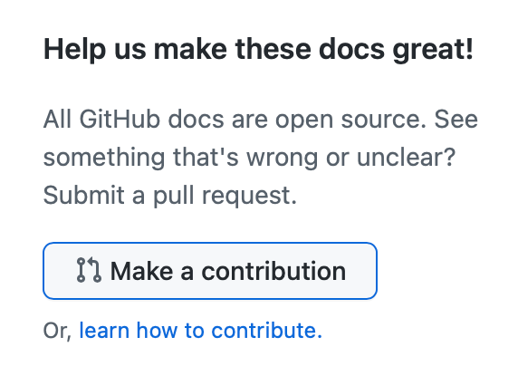

# Welcome to Open-WebUI-Functions contributing guide <!-- omit in toc -->

Thank you for investing your time in contributing to our project!

Read our [Code of Conduct](https://own.dev/github-owndev-open-webui-functions-code-of-conduct) to keep our community approachable and respectable.

In this guide you will get an overview of the contribution workflow from opening an issue, creating a PR, reviewing, and merging the PR.

Use the table of contents icon  on the top left corner of this document to get to a specific section of this guide quickly.

## New contributor guide

To get an overview of the project, read the [README](https://own.dev/github-owndev-open-webui-functions) file. Here are some resources to help you get started with open source contributions:

- [Finding ways to contribute to open source on GitHub](https://docs.github.com/en/get-started/exploring-projects-on-github/finding-ways-to-contribute-to-open-source-on-github)
- [Set up Git](https://docs.github.com/en/get-started/git-basics/set-up-git)
- [GitHub flow](https://docs.github.com/en/get-started/using-github/github-flow)
- [Collaborating with pull requests](https://docs.github.com/en/github/collaborating-with-pull-requests)

## Getting started

For more information on how we write our markdown files, see "[Using Markdown in GitHub](https://docs.github.com/en/get-started/writing-on-github/getting-started-with-writing-and-formatting-on-github/basic-writing-and-formatting-syntax)."

### Issues

#### Create a new issue

If you spot a problem, [search if an issue already exists](https://docs.github.com/en/github/searching-for-information-on-github/searching-on-github/searching-issues-and-pull-requests#search-by-the-title-body-or-comments). If a related issue doesn't exist, you can open a new issue using a relevant [issue form](https://own.dev/github-owndev-open-webui-functions-issues-new).

#### Solve an issue

Scan through our [existing issues](https://own.dev/github-owndev-open-webui-functions-issues) to find one that interests you. You can narrow down the search using `labels` as filters. As a general rule, we don’t assign issues to anyone. If you find an issue to work on, you are welcome to open a PR with a fix.

### Make Changes

#### Make changes in the UI

Click **Make a contribution** at the bottom of any docs page to make small changes such as a typo, sentence fix, or a broken link. This takes you to the `.md` file where you can make your changes and [create a pull request](#pull-request) for a review.

 

#### Make changes locally

1. Fork the repository.
- Using GitHub Desktop:
  - [Getting started with GitHub Desktop](https://docs.github.com/en/desktop/installing-and-configuring-github-desktop/getting-started-with-github-desktop) will guide you through setting up Desktop.
  - Once Desktop is set up, you can use it to [fork the repo](https://docs.github.com/en/desktop/contributing-and-collaborating-using-github-desktop/cloning-and-forking-repositories-from-github-desktop)!

- Using the command line:
  - [Fork the repo](https://docs.github.com/en/github/getting-started-with-github/fork-a-repo#fork-an-example-repository) so that you can make your changes without affecting the original project until you're ready to merge them.

3. Create a working branch and start with your changes!

### Commit your update

Commit the changes once you are happy with them.

### Pull Request

When you're finished with the changes, create a pull request, also known as a PR.
- Fill the "Ready for review" template so that we can review your PR. This template helps reviewers understand your changes as well as the purpose of your pull request.
- Don't forget to [link PR to issue](https://docs.github.com/en/issues/tracking-your-work-with-issues/linking-a-pull-request-to-an-issue) if you are solving one.
- Enable the checkbox to [allow maintainer edits](https://docs.github.com/en/github/collaborating-with-issues-and-pull-requests/allowing-changes-to-a-pull-request-branch-created-from-a-fork) so the branch can be updated for a merge.
Once you submit your PR, a team member will review your proposal. We may ask questions or request additional information.
- We may ask for changes to be made before a PR can be merged. You can apply suggested changes directly through the UI. You can make any other changes in your fork, then commit them to your branch.
- If you run into any merge issues, checkout this [git tutorial](https://github.com/skills/resolve-merge-conflicts) to help you resolve merge conflicts and other issues.

### Your PR is merged!

Congratulations :tada::tada: the **Open-WebUI-Functions** team thanks you :sparkles:.

Once your PR is merged, your posts will be made public.