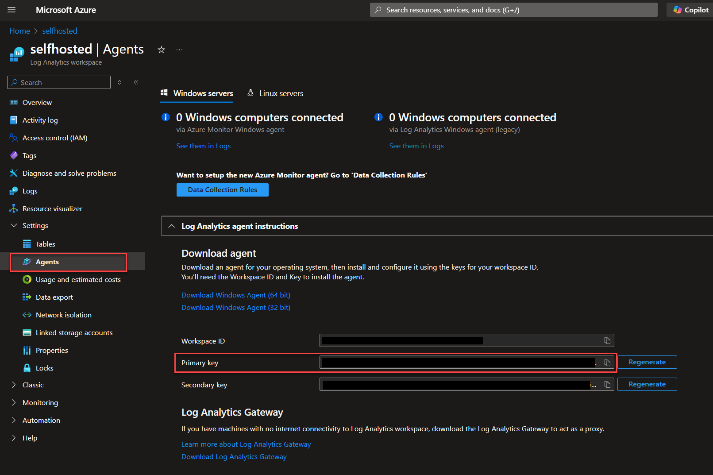
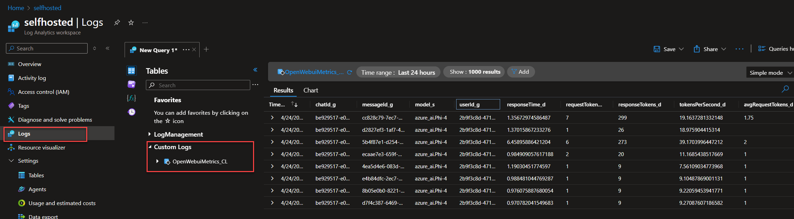

# Setup Azure Log Analytics Workspace
## Installation
- [Create Workspace](https://own.dev/learn-microsoft-com-en-us-azure-azure-monitor-logs-quick-create-workspace)

## Get Shared Key
To send data from Time Token Tracker to Azure Log Analytics, a shared key is required. This can be found under `Settings` > `Agents` > `Primary key`.

 

## Show Logs
To view these logs, go to `Logs` > `Custom Logs`. All logs will be listed there.
> It may take a few minutes for the first logs to become visible.

 

## PowerBI Dashboard
- [PowerBI Dashboard](https://github.com/owndev/Open-WebUI-Functions/discussions/26) from [@zic04](https://github.com/zic04)