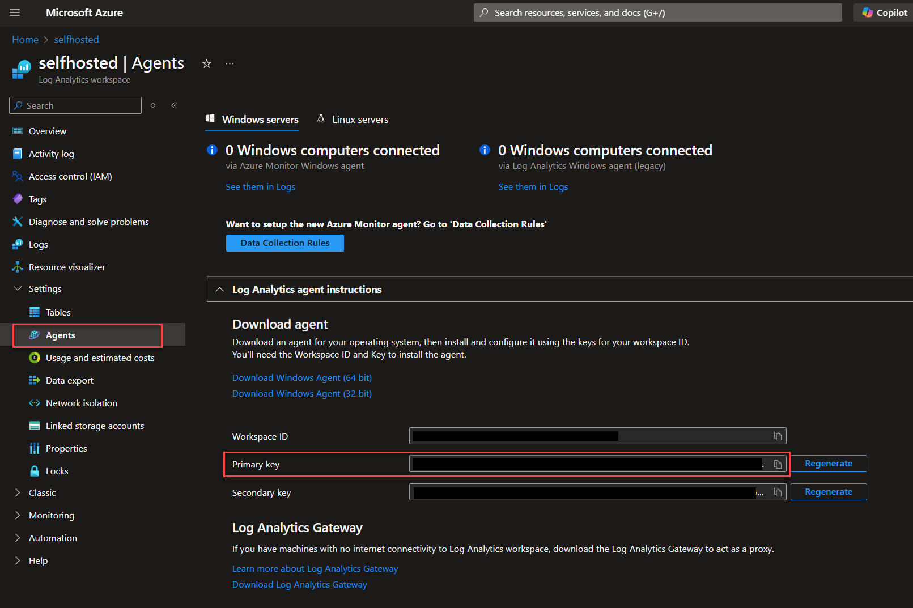
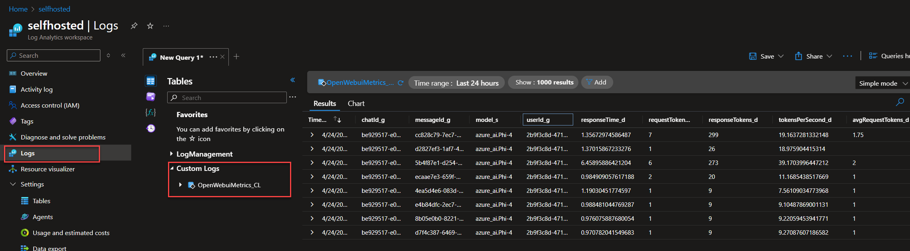

# Setup Azure Log Analytics Workspace

> [!WARNING]
> The Time Token Tracker can send its records through two Azure Monitor APIs:
>
> - the **[Logs Ingestion API](https://learn.microsoft.com/en-us/azure/azure-monitor/logs/logs-ingestion-api-overview)** (recommended, since filter version 2.7.0): a data collection rule (DCR) and a Microsoft Entra ID identity;
> - the **[HTTP Data Collector API](https://learn.microsoft.com/en-us/previous-versions/azure/azure-monitor/logs/data-collector-api)** (`https://<workspace-id>.ods.opinsights.azure.com/api/logs`, signed with the workspace shared key). Microsoft has deprecated it: support ended on **September 14, 2026**, but ingestion still works for clients that use TLS 1.2 or later. It does not work with workspaces behind an Azure Monitor Private Link Scope (AMPLS). As of October 9, 2026, Microsoft has not published a date after which ingestion stops.
>
> While the filter still uses the HTTP Data Collector API, it logs a one-time warning. See [Migrate from the HTTP Data Collector API to the Logs Ingestion API](https://learn.microsoft.com/en-us/azure/azure-monitor/logs/custom-logs-migrate) for Microsoft's guide.

## Installation

- [Create Workspace](https://learn.microsoft.com/en-us/azure/azure-monitor/logs/quick-create-workspace)

## Choose the API

`SEND_TO_LOG_ANALYTICS` is the master switch for both APIs. `LOG_ANALYTICS_INGESTION_API` selects which one the filter uses:

| `LOG_ANALYTICS_INGESTION_API` | Logs Ingestion API | HTTP Data Collector API |
| --- | --- | --- |
| `auto` (default; also any unknown value, with a warning) | when its settings are complete | when the Logs Ingestion settings are not complete (exactly as in 2.6.2). If some Logs Ingestion valves are set but not all, a one-time warning lists the missing ones |
| `logs_ingestion` | when its settings are complete; otherwise nothing is sent and a one-time warning lists the missing valves | never |
| `data_collector` | never | always (the existing shared key setup) |
| `both` | when its settings are complete | when the workspace ID and shared key are set |

- `auto` switches to the Logs Ingestion API as soon as its valves are complete. Keep `data_collector` while you prepare the new setup, and switch when everything is in place.
- `both` writes every record through both APIs. Use it only with a **separate** table ([Option B](#option-b-new-table-side-by-side)). With a migrated table ([Option A](#option-a-migrate-the-table-in-place)) every record would be stored twice.
- The choice depends on the configuration only. A failed send is logged and never switches the API.
- While no API can send (for example `logs_ingestion` with incomplete settings, or `auto` / `both` when neither API is complete), every response also logs the warning `Failed to send data to Log Analytics (chat=..., message=...)`. The one-time warning logged before it names the missing valves.

## Logs Ingestion API

The filter requests a Microsoft Entra ID token itself (no extra Python packages), caches it per identity, refreshes it before it expires and sends each record to `{endpoint}/dataCollectionRules/{immutable ID}/streams/{stream}?api-version=2023-01-01`. Any 2xx answer counts as success (the API answers `204`).

### Permissions for the setup

- **Monitoring Contributor** to create the data collection rule (and a data collection endpoint, if you need one).
- **Log Analytics Contributor** (`Microsoft.OperationalInsights/workspaces/tables/migrate/action`) to migrate the table (Option A) or to create a table (Option B).
- `Microsoft.Authorization/roleAssignments/write` on the DCR for the [role assignment](#role-assignment), for example **Owner**, **User Access Administrator** or **Role Based Access Control Administrator**. Without it, someone who has it must do the role assignment for you.

### Collect the values first

You need these values in the templates and valves below:

- Subscription ID, resource group and workspace name.
- The workspace's **resource ID** and **region**:

  ```bash
  az monitor log-analytics workspace show --resource-group <rg> --workspace-name <workspace> \
    --query "{id: id, location: location}"
  ```

  In the portal: workspace > **Overview** > **JSON View**.
- For a client secret: the app registration's **Directory (tenant) ID** and **Application (client) ID** (**Microsoft Entra ID** > **App registrations** > your app > **Overview**). See [Identity](#identity).
- Azure US Government or Azure operated by 21Vianet: run `az cloud set --name AzureUSGovernment` (or `AzureChinaCloud`) before `az login`, and see [Sovereign clouds](#sovereign-clouds).

### Look at the existing table

Run this query in the workspace (**Logs**):

```kusto
OpenWebuiMetrics_CL | getschema
```

The HTTP Data Collector API names each column after the first value it saw, with a type suffix: `_g` for strings that look like a GUID, `_d` for every JSON number, `_b` for booleans, `_s` for other strings and `_t` for date-times. A later value that does not fit gets another column. For a table filled by the filter you can expect `chatId_g`, `messageId_g`, `model_s`, `userId_g` and/or `userId_s` (`unknown` for requests without a user), `responseTime_d`, `requestTokens_d`, `responseTokens_d`, `tokensPerSecond_d`, `avgRequestTokens_d`, `avgResponseTokens_d`, `tokensEstimated_b` (since 2.6.2) and maybe `timestamp_t` or `chatId_s`. Your table decides; check it with `getschema` before you write the DCR.

Then choose one of the two options:

- **Option A: migrate the table in place.** The table keeps its name and column names, so existing queries, dashboards and the Power BI report keep working. Irreversible.
- **Option B: new table side by side.** A new table with clean column names; the old data stays in `OpenWebuiMetrics_CL`. Queries and dashboards need changes.

### Option A: migrate the table in place

1. Update the filter to 2.7.0 and set `LOG_ANALYTICS_INGESTION_API=data_collector` explicitly, so that entering the new valves later does not switch yet. Make sure at least one record from version 2.6.2 or newer has arrived, so that `tokensEstimated_b` exists.
2. Migrate the table. This is **irreversible**:

   ```bash
   az monitor log-analytics workspace table migrate --resource-group <rg> \
     --workspace-name <workspace> --table-name OpenWebuiMetrics_CL
   ```

   The HTTP Data Collector API keeps writing into the existing columns after the migration.
3. Run `getschema` again ([Look at the existing table](#look-at-the-existing-table)), adapt [template A1](#template-a1-dcr-for-the-migrated-table) to it and create the DCR. Read back its `id`, `immutableId` and logs ingestion endpoint.
4. Assign the role on the DCR ([Role assignment](#role-assignment)).
5. Wait: a new role assignment can take up to 30 minutes, and new data can take up to 15 minutes to show up.
6. Set the Logs Ingestion valves: the identity, `LOG_ANALYTICS_DCR_ENDPOINT` and `LOG_ANALYTICS_DCR_IMMUTABLE_ID`. With template A1, `LOG_ANALYTICS_DCR_STREAM_NAME` can stay empty.
7. Switch `LOG_ANALYTICS_INGESTION_API` to `logs_ingestion` (or `auto`).
8. **Verify.** Send one chat message. The Open WebUI log shows `Log Analytics data sent via the Logs Ingestion API`. After up to 15 minutes, this query shows new rows (rows from the HTTP Data Collector API have `SourceSystem == "RestAPI"`):

   ```kusto
   OpenWebuiMetrics_CL
   | where TimeGenerated > ago(30m)
   | summarize count() by SourceSystem
   ```

   A `204` only means "accepted". If no rows appear, check the DCR metrics **Logs Transformation Errors per Min** and **Logs Rows Dropped per Min** and, after enabling the DCR's error logs, the `DCRLogErrors` table. Usually the `transformKql` does not match the table's columns.
9. **Rollback:** switch back to `data_collector`. This works as long as nobody changed the table schema after the migration. Records that failed while the Logs Ingestion API was active are not resent.

> [!WARNING]
> While the HTTP Data Collector API still writes to the migrated table, do not add columns or edit the schema: that stops legacy ingestion for the whole table. A column that does not exist at migration time cannot be added safely until the Data Collector writes have stopped.

#### Template A1: DCR for the migrated table

Save this as `dcr-openwebui.json`, fill in the region and the workspace resource ID, and adapt `transformKql` to your `getschema` output (see the notes below):

```json
{
  "location": "<workspace region, e.g. westeurope>",
  "kind": "Direct",
  "properties": {
    "streamDeclarations": {
      "Custom-OpenWebuiMetrics_CL": {
        "columns": [
          { "name": "timestamp", "type": "datetime" },
          { "name": "chatId", "type": "string" },
          { "name": "messageId", "type": "string" },
          { "name": "model", "type": "string" },
          { "name": "userId", "type": "string" },
          { "name": "responseTime", "type": "real" },
          { "name": "requestTokens", "type": "long" },
          { "name": "responseTokens", "type": "long" },
          { "name": "tokensPerSecond", "type": "real" },
          { "name": "tokensEstimated", "type": "boolean" },
          { "name": "avgRequestTokens", "type": "real" },
          { "name": "avgResponseTokens", "type": "real" }
        ]
      }
    },
    "destinations": {
      "logAnalytics": [
        {
          "workspaceResourceId": "/subscriptions/<sub>/resourceGroups/<rg>/providers/Microsoft.OperationalInsights/workspaces/<workspace>",
          "name": "workspace"
        }
      ]
    },
    "dataFlows": [
      {
        "streams": ["Custom-OpenWebuiMetrics_CL"],
        "destinations": ["workspace"],
        "transformKql": "source | project TimeGenerated = todatetime(timestamp), chatId_g = tostring(chatId), messageId_g = tostring(messageId), model_s = tostring(model), userId_g = tostring(userId), responseTime_d = toreal(responseTime), requestTokens_d = toreal(requestTokens), responseTokens_d = toreal(responseTokens), tokensPerSecond_d = toreal(tokensPerSecond), tokensEstimated_b = tobool(tokensEstimated), avgRequestTokens_d = toreal(avgRequestTokens), avgResponseTokens_d = toreal(avgResponseTokens)",
        "outputStream": "Custom-OpenWebuiMetrics_CL"
      }
    ]
  }
}
```

Create the DCR with `az rest` (a relative `/subscriptions/...` URL, so `az` uses the Resource Manager endpoint of the current cloud):

```bash
az rest --method put \
  --url "/subscriptions/<sub>/resourceGroups/<rg>/providers/Microsoft.Insights/dataCollectionRules/<dcr-name>?api-version=2023-03-11" \
  --body @dcr-openwebui.json
```

In PowerShell, quote the body argument (`--body '@dcr-openwebui.json'`; a bare `@` is the splatting operator), or use `Invoke-AzRestMethod -Path "<DCR resource ID>?api-version=2023-03-11" -Method PUT -Payload (Get-Content dcr-openwebui.json -Raw)`. `az monitor data-collection rule create --rule-file` is not used here, because it is not verified that it keeps `"kind": "Direct"`.

Read the values back:

```bash
az rest --method get \
  --url "/subscriptions/<sub>/resourceGroups/<rg>/providers/Microsoft.Insights/dataCollectionRules/<dcr-name>?api-version=2023-03-11" \
  --query "{id: id, immutableId: properties.immutableId, endpoint: properties.endpoints.logsIngestion}"
```

- `id` is the scope of the [role assignment](#role-assignment).
- `immutableId` (`dcr-` followed by 32 hex characters) goes into `LOG_ANALYTICS_DCR_IMMUTABLE_ID`.
- `endpoint` goes into `LOG_ANALYTICS_DCR_ENDPOINT`.

Notes on the template:

- **Stream.** The stream name must start with `Custom-` and is local to the DCR. `Custom-OpenWebuiMetrics_CL` is the filter's default stream name (`Custom-<LOG_ANALYTICS_LOG_TYPE>_CL`), so `LOG_ANALYTICS_DCR_STREAM_NAME` can stay empty. `outputStream` `Custom-<table>` selects the table.
- **GUIDs.** `chatId`, `messageId` and `userId` are declared as `string`, because stream declarations have no `guid` type. Log Analytics stores GUIDs as strings, so `tostring()` into a `_g` column is the intended mapping.
- **Adapt to `getschema`.** Transformations support only some functions, among them `toguid`, `iif`, `isnull`, `isnotnull`, `tostring`, `toreal`, `tobool` and `todatetime` (`coalesce` is **not** supported):
  - A table with `userId_s` instead of `userId_g`: use `userId_s = tostring(userId)`.
  - A table with both: `userId_g = iif(isnotnull(toguid(userId)), tostring(userId), ""), userId_s = iif(isnull(toguid(userId)), tostring(userId), "")`. The same applies to `chatId_s`.
  - A table with `timestamp_t`: add `timestamp_t = todatetime(timestamp)`.
  - An output column that does not exist in the table is accepted but not stored.
- **Private link.** For a data collection endpoint (DCE) instead: remove `"kind": "Direct"`, add `"dataCollectionEndpointId": "<DCE resource ID>"` under `properties`, and use the DCE's logs ingestion URL as `LOG_ANALYTICS_DCR_ENDPOINT` (see [DCE and private link](#dce-and-private-link)).

### Option B: new table side by side

1. Update the filter to 2.7.0 and set `LOG_ANALYTICS_INGESTION_API=data_collector` while you prepare.
2. Create the table `OpenWebuiMetricsV2_CL` **first** (the DCR's `outputStream` refers to it). Save this as `table.json`:

   ```json
   {
     "properties": {
       "schema": {
         "name": "OpenWebuiMetricsV2_CL",
         "columns": [
           { "name": "TimeGenerated", "type": "datetime" },
           { "name": "chatId", "type": "string" },
           { "name": "messageId", "type": "string" },
           { "name": "model", "type": "string" },
           { "name": "userId", "type": "string" },
           { "name": "responseTime", "type": "real" },
           { "name": "requestTokens", "type": "long" },
           { "name": "responseTokens", "type": "long" },
           { "name": "tokensPerSecond", "type": "real" },
           { "name": "tokensEstimated", "type": "boolean" },
           { "name": "avgRequestTokens", "type": "real" },
           { "name": "avgResponseTokens", "type": "real" }
         ]
       }
     }
   }
   ```

   ```bash
   az rest --method put \
     --url "/subscriptions/<sub>/resourceGroups/<rg>/providers/Microsoft.OperationalInsights/workspaces/<workspace>/tables/OpenWebuiMetricsV2_CL?api-version=2022-10-01" \
     --body @table.json
   ```

3. Create the DCR from [template A1](#template-a1-dcr-for-the-migrated-table) with two changes (the stream name stays `Custom-OpenWebuiMetrics_CL`, so `LOG_ANALYTICS_DCR_STREAM_NAME` can stay empty):
   - `"outputStream": "Custom-OpenWebuiMetricsV2_CL"`
   - `"transformKql": "source | project TimeGenerated = todatetime(timestamp), chatId, messageId, model, userId, responseTime, requestTokens, responseTokens, tokensPerSecond, tokensEstimated, avgRequestTokens, avgResponseTokens"`
4. Assign the role ([Role assignment](#role-assignment)) and set the Logs Ingestion valves.
5. Set `LOG_ANALYTICS_INGESTION_API=both` during the transition. The HTTP Data Collector API keeps writing to the old table, the Logs Ingestion API to the new one.
6. Verify as in Option A step 8, with `OpenWebuiMetricsV2_CL`.
7. Switch to `auto` (or `logs_ingestion`) once your queries and dashboards use the new table.

**Portal alternative (no CLI).** Workspace > **Tables** > **Create** > **New custom log (DCR based)**. The wizard needs a data collection endpoint (create it first, in the workspace's region) and a sample JSON file: one record with the fields listed under [Record fields](#record-fields-and-sending). In the transformation editor use `source | extend TimeGenerated = todatetime(timestamp)`. The wizard's stream is `Custom-<table name>`, for example `Custom-OpenWebuiMetricsV2_CL`, so set `LOG_ANALYTICS_DCR_STREAM_NAME` to it and use the DCE's logs ingestion URL as `LOG_ANALYTICS_DCR_ENDPOINT`. The immutable ID is in the DCR's **Overview** > **JSON View**. Option A has no portal path: a DCR for an existing table must be created manually.

**Query across both tables:**

```kusto
union
  (OpenWebuiMetrics_CL
   | project TimeGenerated,
             chatId = tostring(column_ifexists("chatId_g", "")), model = model_s,
             userId = tostring(column_ifexists("userId_g", "")),
             responseTime = responseTime_d, requestTokens = tolong(requestTokens_d),
             responseTokens = tolong(responseTokens_d), tokensPerSecond = tokensPerSecond_d),
  (OpenWebuiMetricsV2_CL
   | project TimeGenerated, chatId, model, userId, responseTime, requestTokens,
             responseTokens, tokensPerSecond)
```

In `both` mode every record is in both tables; pick a cut-over time in dashboards.

### Identity

**App registration with a client secret** (`LOG_ANALYTICS_AUTH_MODE=client_secret`, the default):

1. **Microsoft Entra ID** > **App registrations** > **New registration** (no redirect URI).
2. Note the **Application (client) ID** (`LOG_ANALYTICS_CLIENT_ID`) and the **Directory (tenant) ID** (`LOG_ANALYTICS_TENANT_ID`).
3. **Certificates & secrets** > **New client secret**. Copy the secret's **Value** (not the Secret ID) right away; it cannot be shown again. This goes into `LOG_ANALYTICS_CLIENT_SECRET`, which is stored encrypted when `WEBUI_SECRET_KEY` is set.
4. Note the expiry date. An expired secret logs `AADSTS7000222`.

**Managed identity** (`LOG_ANALYTICS_AUTH_MODE=managed_identity`). The filter detects the platform from its environment at every token request:

- **App Service, Functions, Container Apps:** enable a system-assigned or user-assigned identity. For a user-assigned identity, set `LOG_ANALYTICS_CLIENT_ID` to its client ID; leave it empty for the system-assigned one.
- **Virtual machines and scale sets:** the same; the filter calls the instance metadata service (IMDS) directly, never through a proxy.
- **AKS workload identity:** enable workload identity and the OIDC issuer on the cluster (preconfigured on AKS Automatic), label the pod `azure.workload.identity/use: "true"`, annotate its service account with `azure.workload.identity/client-id`, and add a federated credential to the identity with the cluster's OIDC issuer URL, the subject `system:serviceaccount:<namespace>:<service account>` and the audience `api://AzureADTokenExchange`. Tenant and client ID come from `AZURE_TENANT_ID` / `AZURE_CLIENT_ID` (set by the webhook) unless the valves are set. In Azure US Government and 21Vianet also set `LOG_ANALYTICS_AUTHORITY_HOST`: the webhook's `AZURE_AUTHORITY_HOST` is ignored.
- **Not supported:** Service Fabric, Azure Arc, Cloud Shell / Azure Machine Learning, AKS identity bindings and certificate credentials. They log an error; use a client secret there.

### Role assignment

Assign **Monitoring Metrics Publisher** on the DCR to the identity:

- Portal: DCR > **Access control (IAM)** > **Add role assignment** > **Monitoring Metrics Publisher** > **User, group, or service principal** (the app registration) or **Managed identity**.
- CLI:

  ```bash
  az role assignment create --assignee <appId or principalId> \
    --role "Monitoring Metrics Publisher" --scope <DCR resource ID>
  ```

  The DCR resource ID is the `id` you read back after creating the DCR. For a managed identity use its principal (object) ID, shown on the resource's **Identity** page.

A new role assignment can take up to 30 minutes; until then the API answers `403`.

### Valves

Set the valves of the Time Token Tracker filter (**Admin Panel → Functions → Time Token Tracker → Valves**). Every valve can also get a default from an environment variable of the same name in the Open WebUI container; values saved in the valves take precedence.

| Valve / environment variable | Default | Description |
| --- | --- | --- |
| `SEND_TO_LOG_ANALYTICS` | off | `true` turns on sending (`1`, `yes` and `on` also work). Any other value, including `false`, turns it off. The master switch for both APIs. |
| `LOG_ANALYTICS_INGESTION_API` | `auto` | `auto`, `logs_ingestion`, `data_collector` or `both` (see [Choose the API](#choose-the-api)). |
| `LOG_ANALYTICS_DCR_ENDPOINT` | – | The DCR's logs ingestion endpoint (`https://<dcr>-<xxxx>-<region>.logs.z1.ingest.monitor.azure.com`) or a DCE's logs ingestion URL. Must use `https://` (added when the scheme is missing). |
| `LOG_ANALYTICS_DCR_IMMUTABLE_ID` | – | The DCR's `immutableId` (`dcr-...`), not its name or resource ID. |
| `LOG_ANALYTICS_DCR_STREAM_NAME` | `Custom-<LOG_ANALYTICS_LOG_TYPE>_CL` | The stream in the DCR. Empty uses the default, e.g. `Custom-OpenWebuiMetrics_CL`. |
| `LOG_ANALYTICS_AUTH_MODE` | `client_secret` | `client_secret` or `managed_identity` (also AKS workload identity). |
| `LOG_ANALYTICS_TENANT_ID` | – | Directory (tenant) ID, a GUID or domain. Workload identity falls back to `AZURE_TENANT_ID`. |
| `LOG_ANALYTICS_CLIENT_ID` | – | Application (client) ID of the app registration; with `managed_identity` the client ID of a user-assigned identity (empty: system-assigned). Workload identity falls back to `AZURE_CLIENT_ID`. |
| `LOG_ANALYTICS_CLIENT_SECRET` | – | The client secret's value (not its ID). Stored encrypted when `WEBUI_SECRET_KEY` is set. |
| `LOG_ANALYTICS_AUTHORITY_HOST` | `https://login.microsoftonline.com` | Microsoft Entra ID authority, see [Sovereign clouds](#sovereign-clouds). Must use `https://`. |
| `LOG_ANALYTICS_INGESTION_SCOPE` | `https://monitor.azure.com/.default` | Token scope, see [Sovereign clouds](#sovereign-clouds). |
| `LOG_ANALYTICS_WORKSPACE_ID` | – | HTTP Data Collector API only: the workspace ID. |
| `LOG_ANALYTICS_SHARED_KEY` | – | HTTP Data Collector API only: the workspace's primary key. Stored encrypted when `WEBUI_SECRET_KEY` is set. |
| `LOG_ANALYTICS_LOG_TYPE` | `OpenWebuiMetrics` | The custom log name of the HTTP Data Collector API (`<log type>_CL`) and the base of the default stream name. |

> [!NOTE]
> Since 2.7.0 `LOG_ANALYTICS_LOG_TYPE` can also be set by an environment variable; version 2.6.2 ignored it. An installation that set this variable anyway and never saved the valve now sends to `<value>_CL` instead of `OpenWebuiMetrics_CL`. An empty variable (for example `LOG_ANALYTICS_LOG_TYPE=${LOG_ANALYTICS_LOG_TYPE}` in a compose file while the host variable is not set) counts as unset.

The Logs Ingestion settings count as complete when the endpoint, the immutable ID and a stream name are set, `LOG_ANALYTICS_AUTH_MODE` is valid, the endpoint and authority use `https://` and, for `client_secret`, the tenant ID, client ID and client secret are set.

### DCE and private link

A DCR created with `"kind": "Direct"` has its own logs ingestion endpoint (`properties.endpoints.logsIngestion`). You need a data collection endpoint (DCE) only for private link (AMPLS) or for a DCR without that endpoint (older DCRs, the portal wizard). Endpoints cannot be added to an existing DCR.

### Sovereign clouds

| Cloud | `LOG_ANALYTICS_AUTHORITY_HOST` | `LOG_ANALYTICS_INGESTION_SCOPE` |
| --- | --- | --- |
| Azure public | `https://login.microsoftonline.com` | `https://monitor.azure.com/.default` |
| Azure US Government | `https://login.microsoftonline.us` | `https://monitor.azure.us/.default` |
| Microsoft Azure operated by 21Vianet | `https://login.partner.microsoftonline.cn` | `https://monitor.azure.cn/.default` |

The double-slash form `https://monitor.azure.com//.default` from Microsoft's REST tutorial works as well.

### Troubleshooting

Each failed record logs one line in the Open WebUI log. Records are not retried.

| Log line contains | Cause | Fix |
| --- | --- | --- |
| `Exception when sending to Logs Ingestion API: ClientConnectorError` or `TimeoutError` | The endpoint cannot be reached, or does not answer within 10 s: wrong `LOG_ANALYTICS_DCR_ENDPOINT`, DNS, a firewall or proxy, or a workspace behind private link (AMPLS) that needs a DCE. | Check the endpoint and the network path from the Open WebUI container; see [DCE and private link](#dce-and-private-link). |
| `Error sending to Logs Ingestion API: 400` | The record does not match the DCR's stream declaration. | Compare the `streamDeclarations` with the [record fields](#record-fields-and-sending). |
| `Error sending to Logs Ingestion API: 401` | The token was rejected. | `LOG_ANALYTICS_INGESTION_SCOPE` must match the cloud of the endpoint. A second 401 in a row pauses token requests for 30 s. |
| `Error sending to Logs Ingestion API: 403` | The identity has no Monitoring Metrics Publisher role on the DCR, or the assignment is younger than 30 minutes. | Assign the role on the DCR ([Role assignment](#role-assignment)) and wait. |
| `Error sending to Logs Ingestion API: 404` | Wrong endpoint, immutable ID or stream name. | Compare with the values read back from the DCR. |
| `Error sending to Logs Ingestion API: 413` | The record exceeds 1 MB per call. | – |
| `Error sending to Logs Ingestion API: 429` | Throttled (per DCR: 12,000 requests or 2 GB per minute); the line shows `Retry-After`. | The record is dropped. |
| `Could not get a Microsoft Entra ID token ... AADSTS7000215` | Invalid client secret. | Use the secret's value, not its ID. |
| `... AADSTS7000222` | The client secret has expired. | Create a new secret. |
| `... AADSTS700016` | Application not found in the tenant. | Check `LOG_ANALYTICS_CLIENT_ID`, `LOG_ANALYTICS_TENANT_ID` and `LOG_ANALYTICS_AUTHORITY_HOST`. |
| `... AADSTS90002` | Tenant not found. | Check `LOG_ANALYTICS_TENANT_ID` and the cloud's authority. |
| `... AADSTS70011` or `AADSTS500011` | Invalid scope. | `LOG_ANALYTICS_INGESTION_SCOPE` must match the cloud. |
| `... AADSTS700212` | Workload identity: the federated token has the wrong audience. | The federated credential needs the audience `api://AzureADTokenExchange`. |
| `... no managed identity endpoint reachable` | `managed_identity` outside Azure, or no identity assigned. | Assign an identity, or use a client secret. |
| `... (managed identity (App Service)): 400 - check LOG_ANALYTICS_CLIENT_ID` | App Service, Functions or Container Apps: `LOG_ANALYTICS_CLIENT_ID` is not the client ID of a user-assigned identity assigned to the app, or it is empty while the app has no system-assigned identity. The line ends with the token service's message (for example `Unable to load the proper Managed Identity.`) and `correlationId`. | Correct the client ID, or assign the identity to the app (or enable its system-assigned identity). |
| `... workload identity needs a tenant and client ID` | AKS: `AZURE_FEDERATED_TOKEN_FILE` is set, but `AZURE_TENANT_ID` / `AZURE_CLIENT_ID` are not and the valves are empty. The webhook takes the client ID from the service account annotation. | Annotate the service account with `azure.workload.identity/client-id`, check that the pod is labelled `azure.workload.identity/use: "true"` and has the variables (restart it after a change), or set `LOG_ANALYTICS_TENANT_ID` / `LOG_ANALYTICS_CLIENT_ID`. |
| `... AZURE_FEDERATED_TOKEN_FILE could not be read` or `is empty` | AKS: the projected service account token is missing or not readable at that path. | Check the pod label, the service account and the volume the webhook mounts. |
| `... is not supported` | Managed identity on Service Fabric, Azure Arc, Cloud Shell / Azure ML, or AKS identity bindings. | Use a client secret. |
| `could not be decrypted` | The stored client secret was encrypted with another `WEBUI_SECRET_KEY`. | Enter the client secret again. |
| `keeping the cached token for Ns` | A token refresh failed; the still-valid token is used until shortly before it expires. | Fix the cause shown in the line. |
| `Log Analytics record dropped: no usable token` | A token request failed (or tokens keep being rejected) less than 30 s ago. | See the token error logged before it; the next attempt follows automatically after 30 s. |
| `not fully configured (missing: ...)` | Logs Ingestion valves are missing or invalid (`must use https`, `unknown value`). | Set the listed valves. Logged once per process. |
| `Failed to send data to Log Analytics (chat=..., message=...)` | A warning per record: no API can send (see the one-time `not fully configured` warning before it), or the HTTP Data Collector API send failed (see the line before it). | Set the missing valves, or fix the cause shown before it. |
| `does not look like an immutable ID` | `LOG_ANALYTICS_DCR_IMMUTABLE_ID` is not `dcr-` followed by 32 hex characters (it is still used). | Copy `immutableId` from the DCR's JSON view, not the DCR name or resource ID. |
| `HTTP Data Collector API, which Microsoft deprecated` | The filter still sends through the deprecated API. | Set up the Logs Ingestion API. Logged once per process. |
| `Log Analytics data sent via the Logs Ingestion API`, but no rows | The API accepted the record (204), the DCR dropped it. | See Option A step 8: DCR metrics and `DCRLogErrors`; usually `transformKql` does not match the table. |

## HTTP Data Collector API (deprecated)

### Get Shared Key

To send data through the HTTP Data Collector API, a shared key is required. This can be found under `Settings` > `Agents` > `Primary key`.

 

Set `SEND_TO_LOG_ANALYTICS`, `LOG_ANALYTICS_WORKSPACE_ID`, `LOG_ANALYTICS_SHARED_KEY` and optionally `LOG_ANALYTICS_LOG_TYPE` (see [Valves](#valves)). With only these valves set, the filter sends exactly the same request as in version 2.6.2 and logs a one-time deprecation warning. Log Analytics adds a type suffix to the names of custom fields, for example `requestTokens_d` and `tokensEstimated_b`.

## Record fields and sending

When sending is on, each response creates one record with `timestamp` (UTC, ISO 8601 with `Z`), `chatId`, `messageId`, `model`, `userId`, `responseTime`, `requestTokens`, `responseTokens`, `tokensPerSecond` and `tokensEstimated`. With `CALCULATE_ALL_MESSAGES` and `SHOW_AVERAGE_TOKENS` on (the default), it also has `avgRequestTokens` and `avgResponseTokens`. Both APIs get the same record.

The filter sends the record in the background, so the response does not wait for Log Analytics. A send that takes longer than 10 seconds, or more than 5 seconds to connect, is aborted; for the Logs Ingestion API the token request has its own 10 second limit. Failed sends are logged in the Open WebUI log and are not retried.

> [!NOTE]
> Since Open WebUI 0.10, outlet filters also run for requests sent directly to the API (`/api/chat/completions` without a chat). Since version 2.6.2 the filter records these requests as well. They do not belong to a chat, so their `chatId` is a generated UUID.

How the values are measured:

- `requestTokens` counts the messages as the filter's inlet step sees them, before Open WebUI adds RAG context, web search results or a code interpreter prompt.
- While no `tiktoken` encoding is loaded (for example offline, without a `tiktoken` cache), token counts are estimates (about 4 characters per token). Such records have `tokensEstimated` set to `true`, and the status message in the chat shows `~` before the estimated numbers.
- The filter matches each response to its request through the request metadata that Open WebUI 0.11 passes to both filter steps. If the outlet step gets other metadata (for example through the legacy `/api/chat/completed` endpoint), it matches by user, model and last user message instead. If no request matches, the record has `responseTime` and `requestTokens` 0 and a warning is logged.

## Show Logs

To view these logs, go to `Logs` > `Custom Logs`, or run a query such as `OpenWebuiMetrics_CL | take 10` (or `OpenWebuiMetricsV2_CL` for Option B).
> It may take a few minutes for the first logs to become visible, and 10 to 15 minutes after a schema change.

 

## PowerBI Dashboard

- [PowerBI Dashboard](https://github.com/owndev/Open-WebUI-Functions/discussions/26) from [@zic04](https://github.com/zic04)
